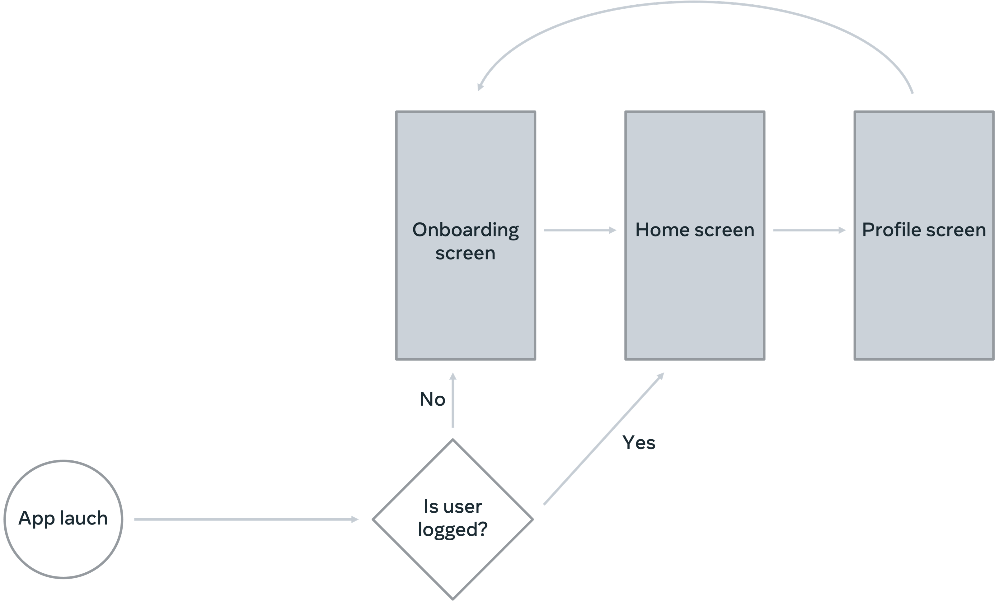

  

<h1 align="center">ios-app-capstone</h>

  
  

# Little Lemon Food Ordering Application

## Project Description
This project marked the conclusion of Meta's iOS Developer Specialization Course, representing the pinnacle of the iOS Developer Development Track.

## Overview

This project involves fetching data from a provided URL via a network call. Once the data is retrieved, it should be stored in a database.

## Steps to Complete the Project

### Step 1: Fetch Data

You will need to make a network call to fetch the data from the URL provided in the task instructions.

### Step 2: Store Data

Once the data is retrieved, store it in a database for future use and easy retrieval.

### Step 3: Format Data for SwiftUI

To display the fetched data within the app, you will need to write code that converts the data into a format suitable for SwiftUI.

### Step 4: Implement Sorting and Filtering

Finally, implement SQL transactions to enable the sorting and filtering of the data, providing a seamless user experience.